# Income Prediction Using Census Data

## Table of Contents

 |  **[Introduction](#introduction)**  |
 **[Exploratory Data Analysis](#exploratory-data-analysis)**  |
 **[Data Cleaning and Feature Engineering](#data-cleaning-and-feature-engineering)**  |
 **[Modeling](#modeling)**  |
 **[Conclusion](#conclusion)** |
 

## Introduction
The task was to predict the income of a person given a set of attributes of each person. These attributes included both demographic information such as sex, age, and education and other information such as whether the person filed taxes or receives Veteran's benefits. 

The data is split into both a training/learning set and a test set with an approximate 2/3, 1/3 split. All EDA and model investigations were done on the training set only; the test set was not touched until it was run through the final model. 

Below I walk through some initial EDA, data cleaning and proprocessing, investigations of 3 differrent classifiers, and the prediction results on the test set. 

## Exploratory Data Analysis
General statistics for the data:
Training set: 199523 
Testing set: 99762

Total number of features: 41 (including target)

After importing the <b>learning/training</b> data into a pandas dataframe, the data looks to be fairly "clean" with no nans. A sample of the data is shown below:

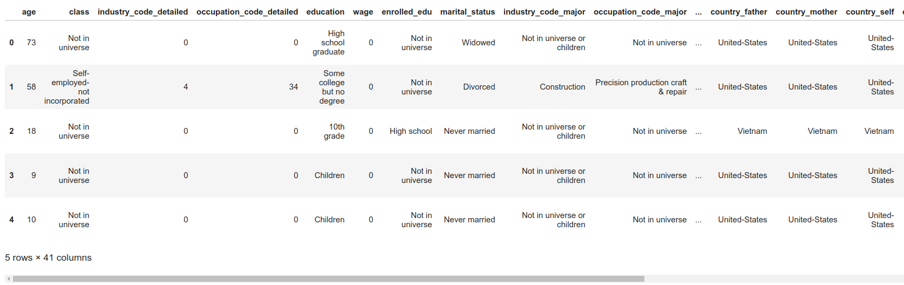

The columns contained in the dataset include:

|Name|Name|Name|
|:---|---|----:|
|`age`|`class`|`industry_code_detailed`
|`occupation_code_detailed`|`education`|`wage`|
|`enrolled_edu`|`marital_status`|`industry_code_major`|
|`occupation_code_major`|`race`|`hispanic`|
|`sex`|`union_mem`|`reason_unemploy`|
|`employment_stat`|`capital_gains`|`capital_losses`|
|`dividends`|`tax_filer_stat`|`residence_region`|
|`residence_state`|`household_descr`|`household_summary`|
|`instance_ignore`|`migration_msa`|`migration_reg`|
|`migration_move_reg`|`live_residence_1yr`|`migration_sunbelt`|
|`num_persons_worked_employer`|`family_under18`|`country_father`|
|`country_mother`|`country_self`|`citizenship`|
|`own_business`|`fill_quest_va`|`veterans_benefits`|
|`weeks_worked_yr`|`year`|`income`|

### Missing Values

Closer inspection shows that many entries have 'Not in universe' or '?', which appears to be synonomous with 'no information' or an nan. These features are all categorical instead of numerical, so imputing these values will be a little easier when a large % of features are missing.

18 of the features have either 'Not in universe' or '?' as a value. The below bar chart shown the percentage of data missing across those 18 features. 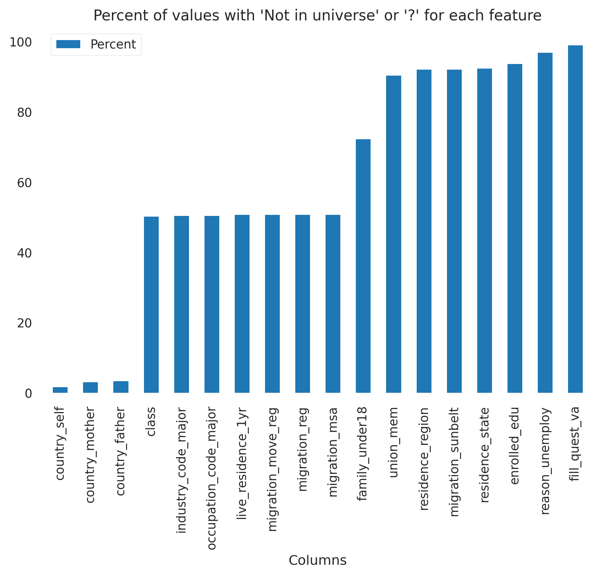

### Visualization of Data

Our target variable, `income`, is a binary variable with two values: < 50k/yr and > 50k/yr, with the former accounting for 93.8% of the data and the latter comprising 6.2% of the data. With such an imbalanced dataset, we'll need to be careful with the metrics we choose for evaluating our model. 

<b>Income</b> 
Breakdown of income across all the data:
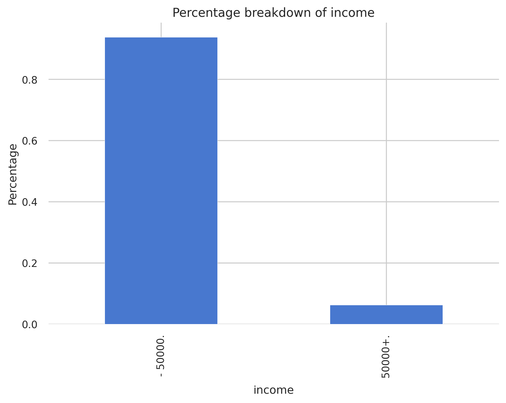

Below are several plots looking at the income breakdown relative to different features. The first plot shows the breakdown in terms of counts, while all the others show as a function of percentage. The latter representation makes it easy to see what features might be important in determining income level. For example, we can easily see that education has a large impact on the proportion of people making > 50k/yr. 

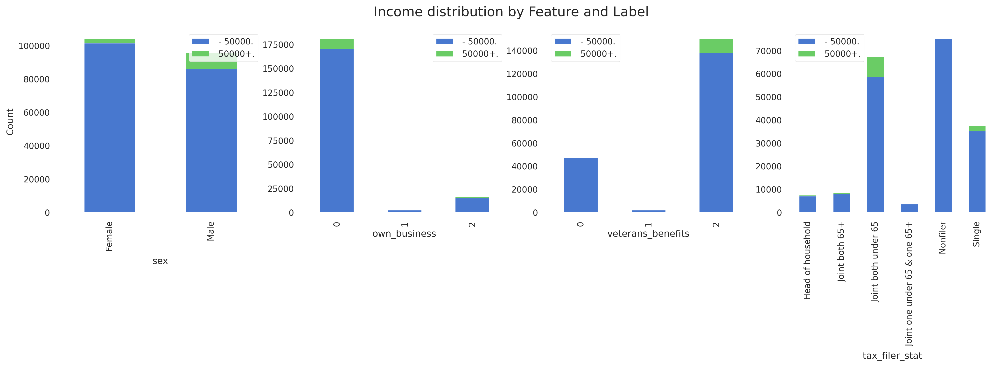
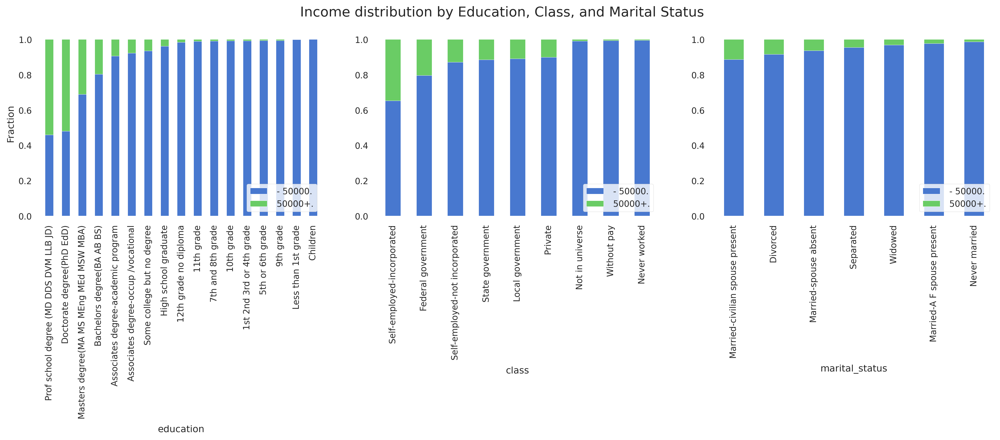
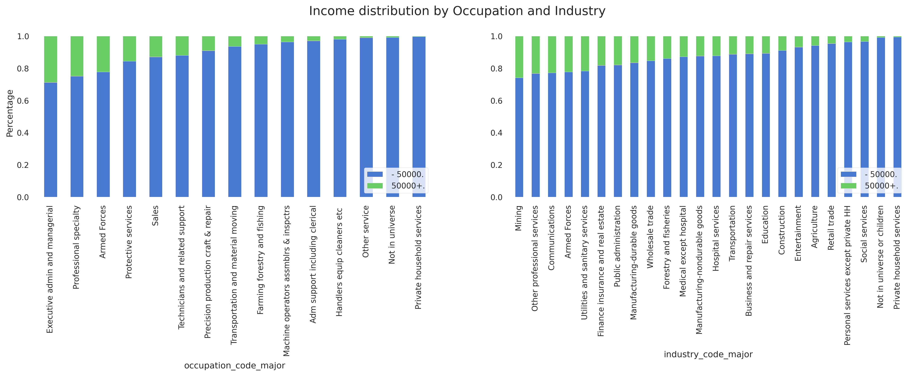

<b>Demographic Information</b> 
Some more visualizations of our data is shown below, although the following plots certainly aren't comprehensive nor representative of everything we can investigate. 

These combined histograms/box plots show the counts of each label and the distribution of each label relative to age. Note the age distribution of those with a marital status of 'Never married', indicating that a large proportion of that label are children (and thus more likely to have a lower income).
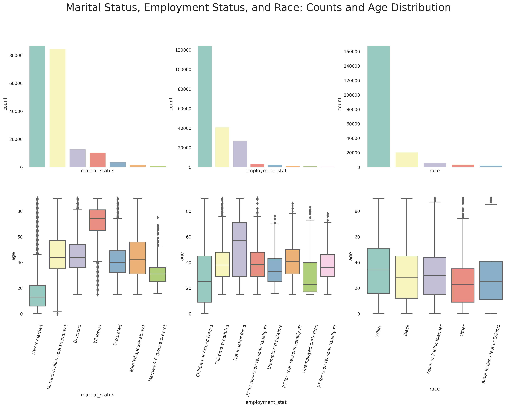
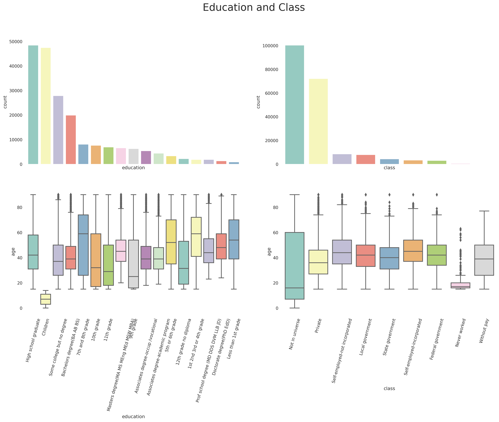

<b>Numerical Features</b> 
The counts of all our numerical data:
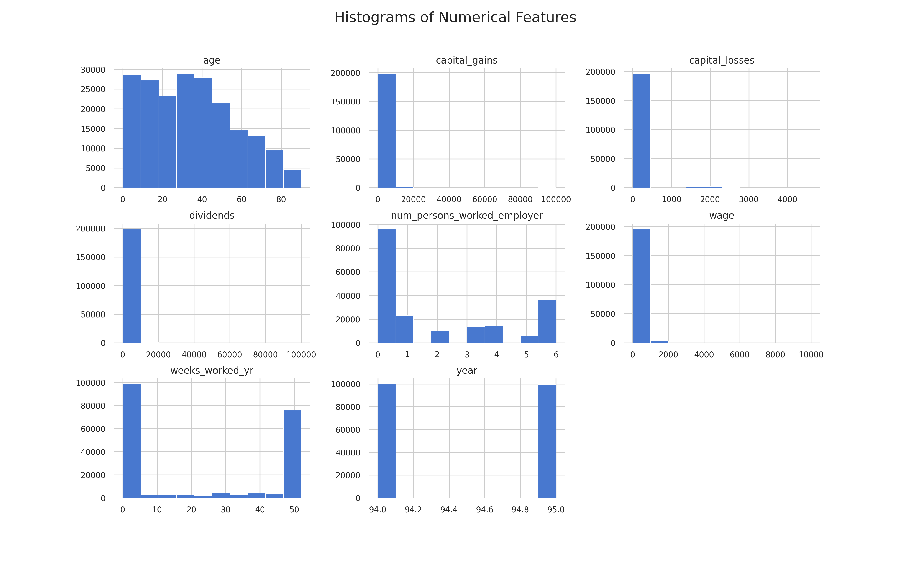

Detailed information on each feature can be found in the [reports folder](reports/). The html file was generated using [Panda's Profiling](https://github.com/pandas-profiling/pandas-profiling), which is an open source plotting library that I find to be particularly useful for getting a cursory view of smaller datasets. Note that the html file needs to be downloaded in order to be viewed. 

## Data Cleaning and Feature Engineering

Our EDA showed that of our 41 columns (remember that `instance ignore` was dropped per metadata instructions):
- 8 were numeric
- 33 were categorical, including our target

Additionally:
- 18 features had missing values, designated by 'Not in universe' instead of the typical 'nan'
- 7 features have > 90% of values missing!
- 55992 observations are for individuals under the age of 18, which is likely why `industry_code` and `occupation_code` are missing. 

<b>Dropping Features</b>
- For a first pass of our data, let's drop the columns with >90% of the data missing. The columns don't appear to be highly related to income, making me reasonably comfortable that they can be excluded for a first pass. 
- `fill_quest_va`	
- `reason_unemploy`	
- `enrolled_edu`
- `residence_region`	
- `residence_state`
- `union_mem`
- `migration_sunbelt`

We also saw when doing EDA that occupation/industry are related to income, although we likely don't need all 4 columns that encode occupation information. `occupation_code_detailed` does not have any missing values, while `occupation_code_major` and `industry_code_major` are missing ~ 50% of their values, I opted to keep `occupation_code_detailed`. 
Similarly, we can get rid of `household_descr` as it overlaps with `household_summary`.

<b>Imputing Data</b>

- For `country_father`, `country_mother`, and `country_self`, roughly 1-3% of the data is missing. The distribution of these values is highly skewed, with 'United States' being the most common value. We filled in `country_self` with the values from `country_mother` or `country_father`, if they existed. We then filled in everything else with the mode. 

<b>Other Considerations</b>
- `class` is missing ~50% of the data and this appears to be an important feature, so we can keep 'Not in universe' as it's own label.
- `migration_reg`, along with `migration_move_reg` and `migration_msa` are all missing ~50% of values. Again, we can treat '?' as it's own label. I would not group the '?' with 'Not in universe' based on EDA results showing different income splits amongst those two labels. 

- `live_residence1_yr` has the labels of 'yes', 'no', and 'Not in universe under 1yr'. The last label *indicates* less than 1 year, but this makes one wonder why the two different 'no' classes. Again, we can make another class. 

- Numeric features will be standardized.

<b>Model Considerations</b>

When preprocessing the data, it's useful to think about the models that we'll be using and what the constraints on the data might be. Some more advanced models, like CatBoost, can handle string labels, so there is no need to bother with OHE or Label Encoding. Tree based models, like RandomForest and XGBoost, handle label encoding better than Linear/Logistic Regression due to the splits treating numeric and categorical data the same. Linear/Logistic Regression are sensitive to collinearity because a singular matrix cannot be inverted. With the high dimensionality we get from OHE, we can use L1 regularization to reduce dimensionality instead of using PCA prior to modeling. 

Preparing numerical variables:
- Standardization was done on all numerical features

Preparing categorical variables:
- OHE was done for logistic regression (with L1 regularization).
- Ordinal Encoding was done for tree-based models. This prevents the model from being highly biased towards numerical features due to the sparse matrix created from OHE. 

Preparing the target:
- Label Encoding was done to the target, with:
    - 0 class = < 50k/yr
    - 1 class = > 50k/yr

A helper function using a column transformer was used to preprocess the entire dataset simultaneously. 
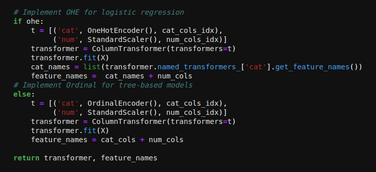

## Modeling
I looked at 3 models:
1. Logistic Regression
2. Random Forest
3. XGBoost

The 'learning' data was split into a training and testing set. All modeling was done on a training set utilizing KFold cross validation and predictions were done on the testing set. The true test data wasn't touched until after a model was selected. 

### Metrics

Because our dataset is imbalanced, we could predict the 0 class 100% of the time and still get 94% accuracy. Looking at the confusion matrix, precision, and recall in addition to the ROC curve is going to give a better idea of performance than just looking at accuracy or the AUC. 

Ultimately the metric I used for optimization was the <b>F1-score</b>, which is a harmonic average of precision and recall. This was chosen because it gives a more accurate representation of how a model is performing on an unbalanced dataset with a minority positive class. 

The evaluation metric can be changed depending on the interests of the client/customer in acurately predicting either the positive or negative class. 

### Model Investigation 

<b>Logistic Regression</b> 
Logistic Regression is a highly interpretable and simple to use model with decent out of the box performance. While the AUC from the ROC (below) is quite good, this good performance is a little misleading. We have a high rate of False Negatives!

|Precision|Recall|F1-Score|AUC|
|:--------|------|--------|---|
|0.73|0.38|0.50|0.94|

The data preprocessing for this model invovled OHE instead of Ordinal Encoding, which adds more granularity to the feature importances; rather than knowing what features are important, we know which labels of the features correspond best to our target. 

The 10 largest and 10 smallest (most negative) coefficients are shown below. As expected from our EDA, education level is a high predictor of the positive class while being female and a non-filer are strongly correlated with the negative class.  The `x1_11` and `x1_7` are occupation codes.

<table>
    <tr>
        <td>
            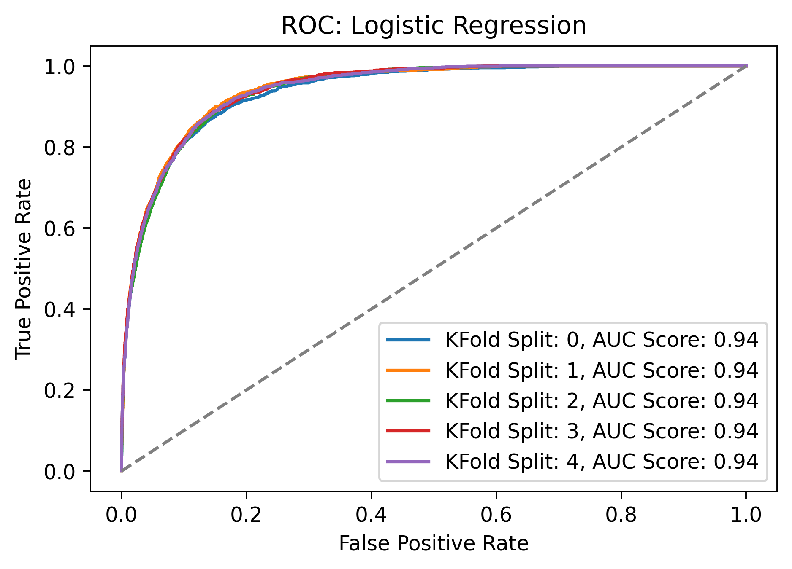
        </td>
        <td>
            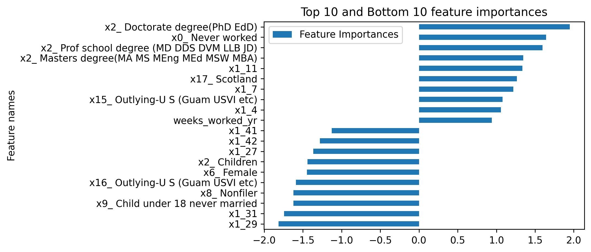
        </td>
    </tr>
    </table>

<b>Random Forest</b> 
The Random Forest model makes use of an ensemble of predictors (trees) to yield a single robust model. 
Similarly to Logistic Regression, we have an excellent AUC with a lower precision and recall. Overall, the F1 score is better than for Logistic Regression. 

|Precision|Recall|F1-Score|AUC|
|:--------|------|--------|---|
|0.71|0.40|0.52|0.93|

A grid search was done to find an optimized model. Parameters that were changed were the number of estimators, max features, class weights, and max depth. The dataset was large enough and the combinations of parameters high enough that running the grid search took about 30 minutes. 

The optimized model performance:

|Precision|Recall|F1-Score|AUC|
|:--------|------|--------|---|
|0.58|0.58|0.58|0.94|

Much like with the logistic regression model, the feature importances showed that occupation code and education were quite important. 
<table>
    <tr>
        <td>
            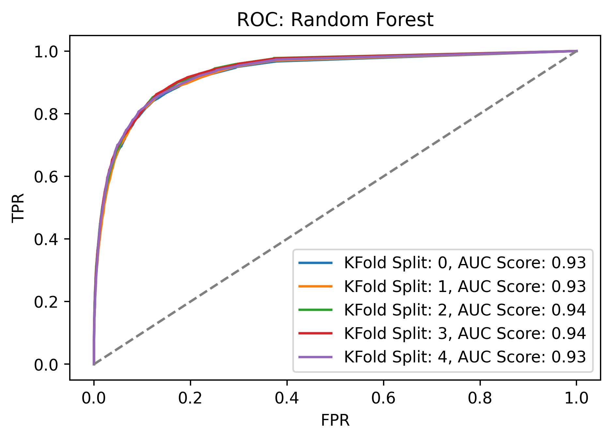
        </td>
        <td>
            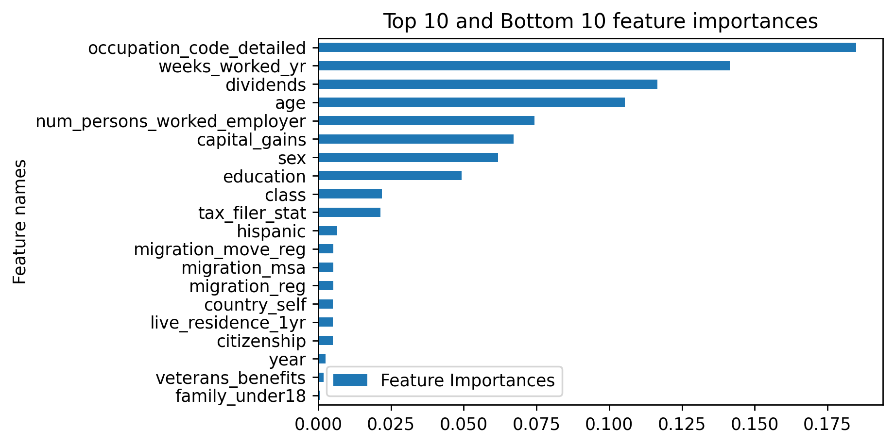
        </td>
    </tr>
    </table>

<b>XGBoost</b> 
XGBoost is also an ensemble method that uses the gradient boosting algorithm to iteratively build up a model. Out of the box performance was marginally better than RandomForest. 

Initial metrics:

|Precision|Recall|F1-Score|AUC|
|:--------|------|--------|---|
|0.75|0.47|0.58|0.95|

Similarly to Random Forest, a grid search was done to optimize model performance. Parameters that were optimized include min child weight, gamma, subsampling, and max depth. Frustrainingly, the optimized model found via gridsearch actually had the same performance as the out of the box model. It also took about 2 hours to run! 

The XGBoost model found that the most important features were weeks_worked_yr, capital_gains, sex, occupation_code, and dividends. 
<table>
    <tr>
        <td>
            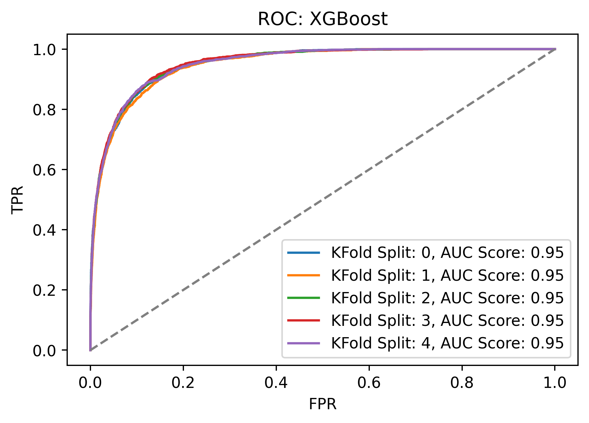
        </td>
        <td>
            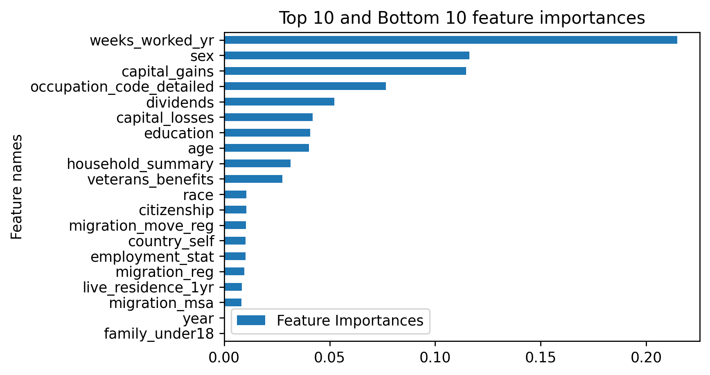
        </td>
    </tr>
    </table>

<b>The Best Model</b> 
RandomForest and XGBoost both performed well and could be optimized to minimize False Negatives and improve the F1-score. The best model chosen to predict on the test set was XGBoost with the default parameters set (although for a higher recall, we could have chosen the optimized RandomForest model)

### Performance on the Test Set

The pipeline for predicting on the test set:

1. Clean data
2. Preprocess data using the transformer that was fitted on the training data
3. Make income predictions using our best model that has been trained on our training data. 

Below are the confusion matrix, ROC, and top 10 feature importances. 

<table>
    <tr>
        <td>
            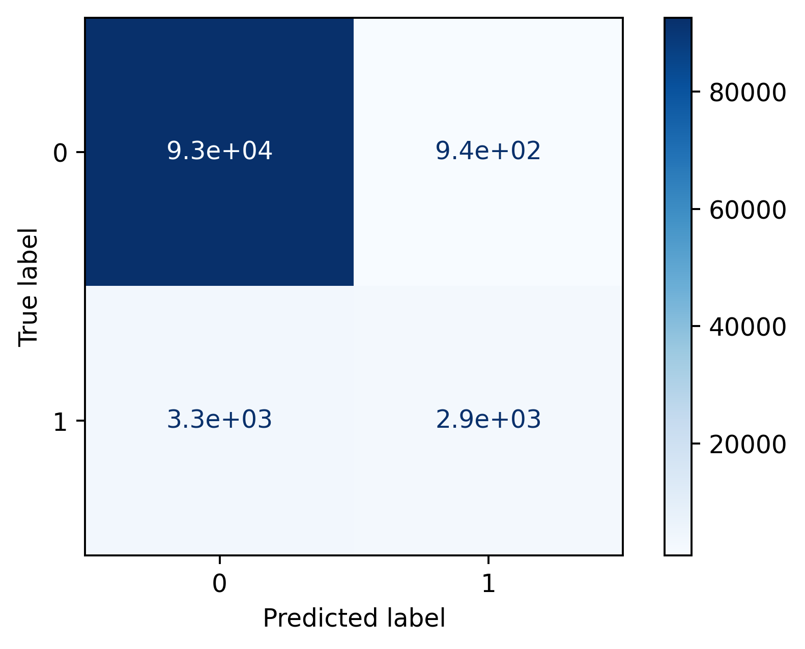
        </td>
        <td>
            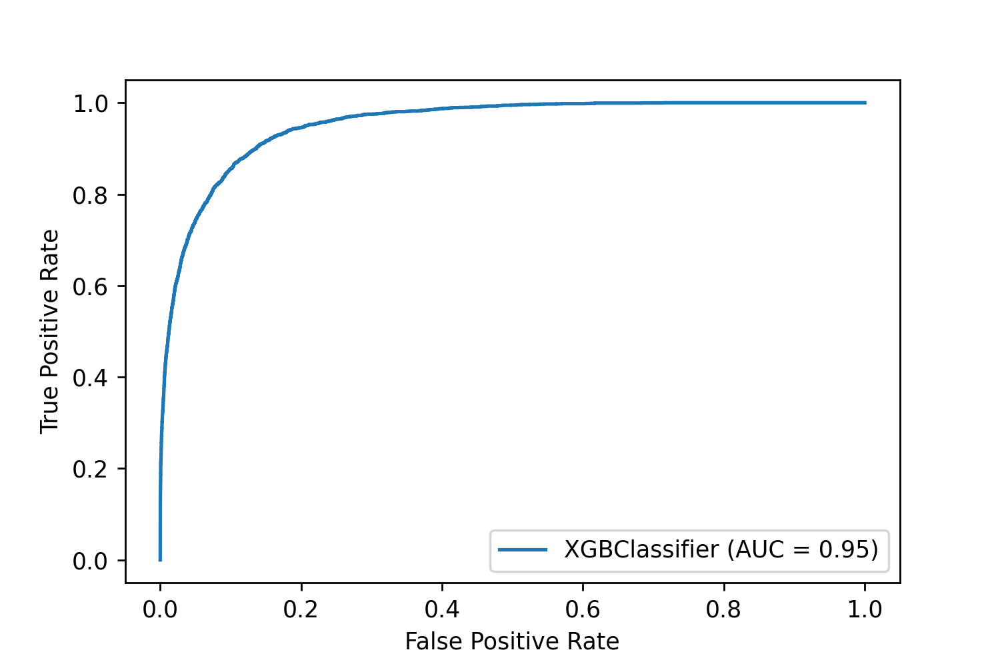
        </td>
    </tr>
    </table>

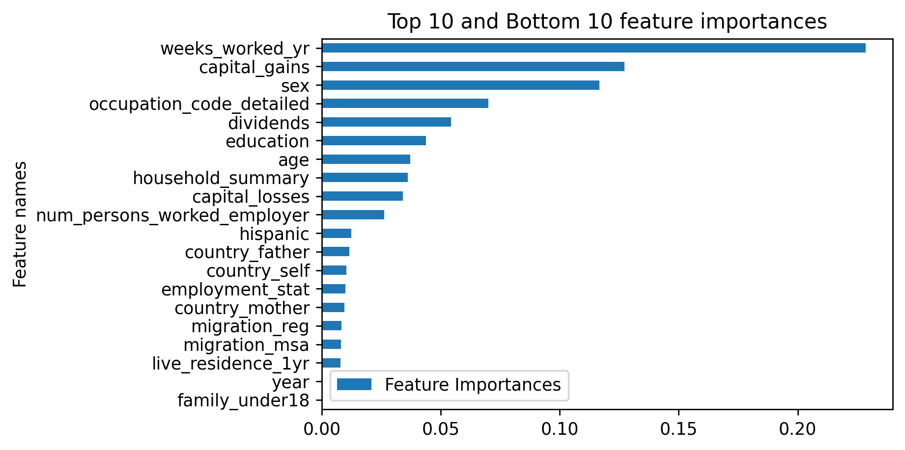

## Conclusion

All three classifiers performed similarly, with RandomForest and XGBoost performing the best. All models had issues with a high number of false negatives, although optimization allowed us to modify the model based on our preferred metric. Given that the dataset was quite imbalanced, we expect to have a high out of the box accuracy with all models. 

The exact order of the features of most importance varied across the models, but all selected occupation code, sex, and education to be important. The tree-based models found dividends and capital gaines to also be of high importance, which intuitively makes sense as people who have capital gains/losses generally have enough income for investing. 

<b>Challenges</b>
- Dealing with missing data
Deciding when to drop a feature entirely can often come down to intuition. If a feature seems likely correlated with the target, it is worth keeping. Otherwise, it can probably be safely dropped. Additionally, filling in missing data when ~50% of the labels are missing can also be difficult, but luckily our missing data were all categorial variables and we could easily make another class representing the missing data. 

- Optimizing models
There are A LOT of ways to optimize a model, and I only skimmed the surface. Instead of altering the data, I ended up doing a gridsearch of model hyperparameters to improve performance. This approch took a while as doing a brute force grid search instead of a randomized grid search can take hours. 

More work could certainly be done in regards to feature selection and feature engineering, such as more thoroughly imputing the missing data for industry and occupation or doing dimensionality reduction with the OneHotEncoded data. 